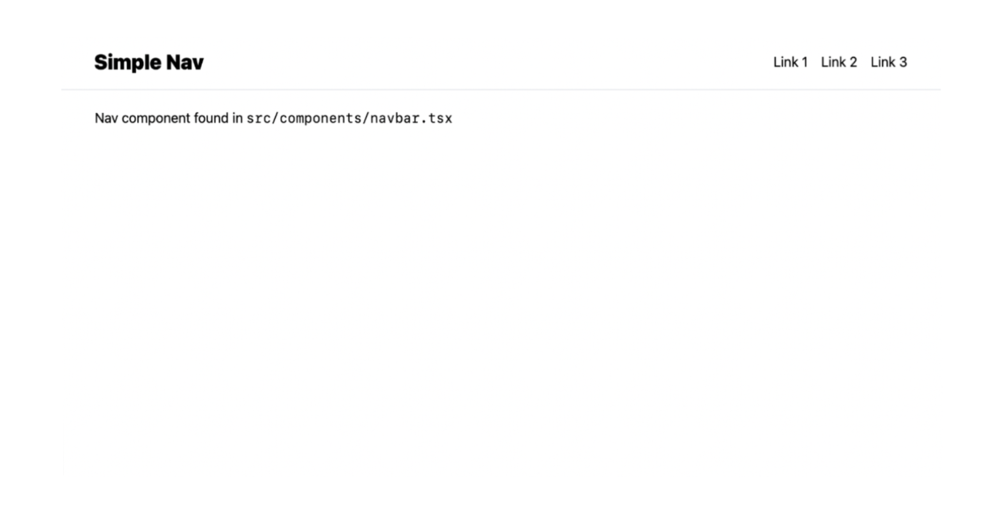

# Simple Nav

Simple React /Tailwind CSS navigation component using HeadlessUI.

 

- [TailwindCSS](https://tailwindcss.com/) with [Auto Sorting](https://tailwindcss.com/blog/automatic-class-sorting-with-prettier)
- [React Absolute Imports](https://create-react-app.dev/docs/importing-a-component/#absolute-imports)
- [Husky](https://github.com/typicode/husky) / [Lint-staged](https://github.com/okonet/lint-staged)
- [ Prettier Linting](https://github.com/prettier/eslint-plugin-prettier)
- [SCSS &amp; SASS](https://sass-lang.com/)
- [TypeScript](https://www.typescriptlang.org/)
- [Yarn 3](https://yarnpkg.com/)

## Available Scripts

In the project directory, you can run:

### `npm start`

Runs the app in the development mode.\
Open [http://localhost:3000](http://localhost:3000) to view it in the browser.

The page will reload if you make edits.\
You will also see any lint errors in the console.

### `npm run build`

Builds the app for production to the `build` folder.\
It correctly bundles React in production mode and optimizes the build for the best performance.

The build is minified and the filenames include the hashes.\
Your app is ready to be deployed!

See the section about [deployment](https://facebook.github.io/create-react-app/docs/deployment) for more information.

### `npm lint`

Launches TypeScript Checker and fixes linting errors according to the rules set in your .ESLint config found.

### `npm format`

Launches the formatter and checks for formatting errors.

### `npm test`

Launches the test runner in the interactive watch mode. See the section about [running tests](https://facebook.github.io/create-react-app/docs/running-tests) for more information.

## Learn More

You can learn more in the [Create React App documentation](https://facebook.github.io/create-react-app/docs/getting-started).

To learn React, check out the [React documentation](https://reactjs.org/).
